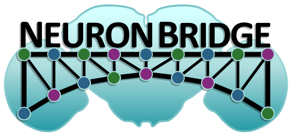

# NeuronBridge

  

NeuronBridge is a web-based service for neuron matching and searching in _Drosophila melanogaster_. It indexes large data sets of LM and EM imagery to enable finding similar neurons across modalities and data sets. A preprint descibing the service is [available on bioRxiv](https://doi.org/10.1101/2022.07.20.500311). 

Visit the service here:

> **Note** 
> The pre-release site is only accessible on Janelia's internal network

## Source Code

This repository contains the web client. Other related repositories:

* [neuronbridge-services](https://github.com/JaneliaSciComp/neuronbridge-services) - Backend implementation
* [neuronbridge-aligners](https://github.com/JaneliaSciComp/neuronbridge-aligners) - Aligner implementation
* [neuronbridge-precompute](https://github.com/JaneliaSciComp/neuronbridge-precompute) - Precompute scripts
* [neuronbridge-python](https://github.com/JaneliaSciComp/neuronbridge-python) - Python API
* [neuronbridge-vol-viewer](https://github.com/JaneliaSciComp/neuronbridge-vol-viewer) - Web-based 3D Volume Viewer
* [colormipsearch](https://github.com/JaneliaSciComp/colormipsearch) - Color Depth MIP Search Algorithms

## Data Availability

The imagery and metadata are stored on AWS S3, and are available for browsing and reuse, subject to the license agreement:

* [Color Depth MIPS](https://open.quiltdata.com/b/janelia-flylight-color-depth)
* [Precomputed CDM match metadata](https://open.quiltdata.com/b/janelia-neuronbridge-data-prod)
* [Precomputed PPPM match metadata](https://open.quiltdata.com/b/janelia-ppp-match-prod)

## Release Notes

View the [Release Notes](public/RELEASENOTES.md) for a history of changes to the web client.

## Development

Read the [Developer's Guide](docs/Development.md) for more information about developing and deploying this service.

## License

All code related to NeuronBridge is made available under the [3-Clause BSD License](LICENSE.md). 

All data served by the application is made available under the [Creative Commons Attribution 4.0 International License](https://creativecommons.org/licenses/by/4.0/).

Studies and publications that use this software should cite [doi:10.1101/2022.07.20.500311](<https://doi.org/10.1101/2022.07.20.500311>).
